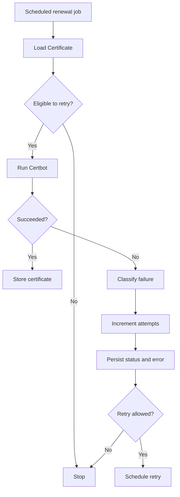

# 11 — Issue Investigation and Context Compilation

## Goal

Make Beagle useful when the user starts with a problem description instead of an exact symbol.

Example:

```text
TLS certificate renewal can fail because of DNS validation,
rate limits, or Certbot errors. After five attempts we stop.
After a long delay, some failures may be safe to retry.
```

Beagle should locate the relevant workflow, reconstruct the important execution path, identify state and retry logic, and return compact source-backed context for Claude Code.

## Primary commands

```bash
beagle investigate "TLS certificate renewal stops after 5 attempts"

beagle context   "How does TLS certificate renewal retry work?"   --intent investigate   --max-tokens 6000

beagle trace "Certificate.renew"   --framework-events   --depth 2

beagle explain "Certificate.renew"   --framework-events   --mermaid
```

## Expected output

```text
Likely area
Primary entrypoints
Probable workflow
Retry and stop conditions
Failure handling
State and field changes
External systems and commands
Framework lifecycle
Related tests
Likely change points
Unknowns
Exact source ranges
```

Beagle should provide evidence for understanding or changing the behavior. It should not decide product policy.

---

## 1. Investigation pipeline

```text
Issue text
   |
   +-- preserve exact phrases, identifiers, and numbers
   +-- normalize terms
   +-- create a small deterministic search plan
   |
   +-- search symbols and source observations
   |
   +-- rank candidate entities
   |
   +-- expand graph around strong candidates
   |
   +-- reconstruct probable workflows
   |
   +-- select important evidence
   |
   +-- compile context under a token budget
   |
   +-- return compact result for Claude
```

The initial implementation should be deterministic. Do not require a local LLM.

---

## 2. Query analysis

Extract:

```text
domain terms
exact phrases
error messages
external commands
numeric limits
time-related phrases
state names
action words
```

For the TLS example:

```text
domain:
  TLS certificate renewal

errors:
  DNS validation
  rate limit
  Certbot failure

limits:
  5 attempts

time:
  long delay

actions:
  retry
  stop

likely state:
  attempt counter
  last attempt time
  status
  error
```

Preserve the original wording for exact search.

## Query normalization

Add simple deterministic variants:

```text
renewal        → renew, renewed
attempts       → attempt, retry count
Certbot        → certbot
rate limits    → rate limit, too many requests
DNS validation → dns challenge, validation error
```

Keep expansion small. Do not generate dozens of speculative synonyms.

## Numbers

Treat numeric values as strong signals only when they appear near related concepts.

Example:

```text
5
```

must not rank every function containing `5`.

Prefer:

```text
5 near retry
5 near attempt
comparison against 5
constant named MAX_RETRIES
```

---

## 3. Search coverage

Search across:

```text
symbol names
qualified names
signatures
docstrings
comments
string literals
exception messages
numeric comparisons
shell and subprocess arguments
DocType names
field names
hook targets
background job targets
test names
```

Search results must remain symbol-scoped.

Return the enclosing function, method, class, or DocType rather than an unstructured file match.

## Strong seed signals

Rank candidates higher when they contain several issue concepts:

```text
certificate + renewal
certbot + failure
attempt + comparison
retry + status write
scheduler + certificate
```

A candidate matching one generic term such as `error`, `retry`, or `status` should rank low.

---

## 4. Candidate ranking

Suggested scoring signals:

```text
exact qualified-name match
exact symbol-name match
exact phrase match
external command match
exception-message match
numeric threshold near a relevant concept
multiple issue concepts in one symbol
Frappe hook or scheduler relationship
background job relationship
state-field write
graph proximity to a stronger candidate
test relationship
```

Penalties:

```text
generic keyword-only match
large unrelated utility module
low-confidence graph edge
distant graph node
match only in generated or vendored code
```

Keep score explanations so results remain inspectable.

Example:

```text
Certificate.renew
score: 18.4

reasons:
  + exact "certificate" match
  + exact "renew" match
  + calls Certbot wrapper
  + writes renewal_attempts
  + scheduled job target
```

---

## 5. Seed selection

Select a small group of initial candidates:

```text
maximum primary seeds: 5
maximum secondary seeds: 10
```

Primary seeds should represent different possible workflow areas rather than five near-duplicate functions.

Prefer diversity:

```text
scheduler entrypoint
controller method
external command wrapper
failure handler
retry policy function
```

---

## 6. Graph expansion

Expand from strong seeds through:

```text
CALLS
CALLED_BY
ENQUEUES
INVOKES
READS_DOCTYPE
WRITES_DOCTYPE
READS_FIELD
WRITES_FIELD
TESTS
HAS_CONTROLLER
TRIGGERS_EVENT
HANDLED_BY
```

Use the Frappe lifecycle expansion from the earlier lifecycle plans.

## Expansion limits

Default:

```text
explicit call depth: 2
framework lifecycle depth: 2
maximum entities: 80
maximum source candidates: 30
```

Stop expansion when:

```text
confidence is too low
the node is already visited
the path becomes generic infrastructure
the token budget cannot include useful evidence
```

---

## 7. Workflow reconstruction

Build one or more probable workflows.

Example shape:

```text
scheduled renewal job
  → load Certificate
  → check renewal eligibility
  → check attempts and last attempt time
  → run Certbot
  → classify failure
  → increment attempt counter
  → persist status and error
  → schedule next retry or stop
  → save document
  → lifecycle handlers
```

## Path types

Distinguish:

```text
explicit Python call
background job dispatch
Frappe lifecycle dispatch
hook dispatch
direct database write
external command boundary
conditional branch
uncertain inferred path
```

Do not flatten all path types into ordinary calls.

## Multiple workflows

When evidence supports more than one path, return:

```text
Workflow A — scheduled renewal
Workflow B — manual renewal
Workflow C — retry job
```

Rank them and explain why each was included.

Do not merge incompatible paths into one fictional workflow.

---

## 8. Condition and state analysis

For investigation queries, prioritize:

```text
comparisons
retry counters
maximum-attempt constants
time comparisons
status checks
early returns
exception handlers
field writes
error persistence
queue scheduling
```

## Retry policy extraction

Detect patterns such as:

```python
if attempts >= 5:
    return

if now() < next_retry_at:
    return

attempts += 1
```

Represent:

```text
condition
source range
variables and fields involved
true branch effect
false branch effect
confidence
```

## State transitions

When possible, summarize:

```text
Pending
  → Renewing
  → Active

Renewing
  → Failed
  → Retry Scheduled

Failed
  → Stopped after maximum attempts
```

Only include transitions supported by source-backed writes and conditions.

---

## 9. External boundaries

Identify calls to:

```text
subprocess
shell commands
Certbot
HTTP APIs
DNS providers
filesystem operations
system services
```

For each boundary, return:

```text
calling symbol
command or API
arguments when statically known
exit-code handling
stdout/stderr handling
exception handling
source range
```

Do not expose secret values.

---

## 10. Frappe-specific context

Include:

```text
DocType controller
relevant fields
scheduler hooks
background jobs
document lifecycle events
doc_events handlers
controller overrides
controller extensions
whitelisted entrypoints
tests
```

For a save operation, include implicit lifecycle only when the DocType and operation are resolved with sufficient confidence.

Keep framework-dispatched behavior under:

```text
Implicit Frappe lifecycle
```

Do not mix it indistinguishably with explicit calls.

---

## 11. Context compiler

The context compiler selects exact source ranges for Claude.

## Output modes

### Compact

```text
entity
relationship
reason included
confidence
path and range
```

### Source

Includes selected source excerpts.

## Suggested budget

For `investigate`:

```text
Primary workflow             30%
Conditions and state         20%
Failure handling             15%
Framework lifecycle          10%
External boundaries          10%
Tests                        10%
Unknowns and uncertainty      5%
```

Budgets are guidelines. The compiler may rebalance when a category is empty.

## Source selection rules

Prefer:

```text
exact function or method ranges
small related constants
specific hook declarations
relevant DocType fields
targeted test methods
```

Avoid:

```text
complete files
large unrelated classes
all callers
all tests
framework internals already summarized by policy
```

## Deduplication

If several paths include the same source range, include it once and list all inclusion reasons.

---

## 12. Result format

Suggested structured result:

```json
{
  "query": "TLS certificate renewal stops after 5 attempts",
  "primary_workflows": [],
  "conditions": [],
  "state_changes": [],
  "external_boundaries": [],
  "framework_events": [],
  "tests": [],
  "change_points": [],
  "unknowns": [],
  "sources": []
}
```

Human-readable output should follow:

```text
Summary
Likely workflow
Important conditions
State changes
Failure paths
Framework lifecycle
External boundaries
Tests
Likely change points
Unknowns
Sources
```

Every claim should map to one or more source items.

---

## 13. Likely change points

Beagle may identify likely change locations based on evidence.

For the TLS issue:

```text
retry eligibility condition
maximum-attempt condition
next-retry scheduling
attempt reset behavior
failure classification
tests for delayed retry
```

Beagle must label these as:

```text
Likely change points
```

It must not claim that all of them require modification.

---

## 14. Unknowns

Always report important missing evidence.

Examples:

```text
site-configured Server Scripts were not indexed
installed-app order is unknown
Certbot response classification is runtime-dependent
receiver DocType could not be resolved
retry interval comes from configuration not present in the repository
```

Do not hide incomplete coverage.

---

## 15. Mermaid integration

`investigate` may optionally produce a compact Mermaid diagram.

```bash
beagle investigate --file issue.md --mermaid
```

Example shape:



The real diagram must be generated from indexed evidence.

Rules:

```text
maximum 20 nodes
every node maps to source
every edge maps to code or framework policy
uncertain edges are visibly distinct
business-relevant steps only
```

---

## 16. CLI

Add:

```bash
beagle investigate "<issue>"
beagle investigate --file issue.md
beagle investigate "<issue>" --compact
beagle investigate "<issue>" --include-source
beagle investigate "<issue>" --mermaid

beagle context "<question>"   --intent investigate   --max-tokens 6000
```

Useful debug options:

```bash
--show-query-terms
--show-scores
--show-paths
--show-unknowns
```

---

## 17. MCP

Expose:

```text
investigate(
    query,
    max_tokens=6000,
    include_source=false,
    include_mermaid=false
)

context(
    query,
    intent="investigate",
    max_tokens=6000
)
```

MCP responses should default to compact mode.

Claude can request source ranges in follow-up calls.

## Claude usage

For an issue or symptom:

```text
1. call investigate
2. inspect primary workflow and unknowns
3. request exact source for important ranges
4. use trace or relations for unclear paths
5. fall back to Grep/Read only when coverage is missing
```

---

## 18. Implementation phases

### Phase A — query analysis

- [ ] Preserve exact phrases.
- [ ] Extract identifiers and numbers.
- [ ] Add small deterministic term expansion.
- [ ] Add query-debug output.
- [ ] Add unit tests for issue parsing.

### Phase B — symbol-scoped search

- [ ] Search symbols, docstrings, comments, and source.
- [ ] Search string literals and exception messages.
- [ ] Search numeric comparisons.
- [ ] Search commands and API boundaries.
- [ ] Search DocType and field metadata.
- [ ] Return enclosing entities and evidence.

### Phase C — candidate ranking

- [ ] Implement scoring signals.
- [ ] Add generic-term penalties.
- [ ] Add candidate diversity.
- [ ] Store score explanations.
- [ ] Add ranking benchmarks.

### Phase D — workflow expansion

- [ ] Expand callers and callees.
- [ ] Expand hooks and jobs.
- [ ] Expand DocType and field relationships.
- [ ] Expand Frappe lifecycle events.
- [ ] Add path-type labels.
- [ ] Add cycle and depth limits.

### Phase E — condition and state extraction

- [ ] Detect comparisons and thresholds.
- [ ] Detect retry counters.
- [ ] Detect time-based conditions.
- [ ] Detect early returns.
- [ ] Detect status and error writes.
- [ ] Detect queue scheduling.

### Phase F — context compilation

- [ ] Define category budgets.
- [ ] Rank source ranges.
- [ ] Deduplicate source.
- [ ] Enforce token limits.
- [ ] Return compact and source modes.
- [ ] Report unknowns.

### Phase G — CLI and MCP

- [ ] Add `beagle investigate`.
- [ ] Add `investigate` intent to context.
- [ ] Add compact structured output.
- [ ] Add MCP tool.
- [ ] Add optional Mermaid output.
- [ ] Add Claude usage instructions.

---

## 19. Synthetic benchmarks

Create cases for:

1. exact error-message match;
2. numeric retry threshold;
3. named retry constant;
4. external command failure;
5. scheduled job;
6. status-field write;
7. time-based retry condition;
8. early-return stop condition;
9. Frappe save followed by lifecycle handlers;
10. nested background job;
11. multiple plausible workflows;
12. generic keyword noise;
13. missing source evidence;
14. uncertain DocType;
15. relevant tests.

---

## 20. Real issue benchmarks

Select at least 20 real issues from pinned Press and Frappe commits.

Each gold case records:

```text
expected primary workflow
expected entrypoints
important conditions
important state fields
external boundaries
framework lifecycle
relevant tests
likely change points
must-not-include files
known unknowns
```

The TLS certificate renewal issue should be the first real benchmark.

After manual verification, expected evidence should include:

```text
renewal entrypoint
scheduler or retry job
attempt counter
maximum-attempt condition
time-based retry behavior if present
Certbot boundary
failure classification
state and error writes
document lifecycle handlers
related tests
```

---

## 21. Targets

```text
Primary workflow in top 3               >= 90%
Primary entrypoint recall               >= 90%
Critical condition recall               >= 90%
Important state-write recall            >= 90%
External-boundary recall                >= 90%
Relevant test recall                    >= 85%
Irrelevant context ratio                <= 20%
Unsupported high-confidence claims      = 0
```

Performance:

```text
Issue analysis p95                      < 150 ms
Candidate ranking p95                   < 200 ms
Depth-2 workflow expansion p95          < 500 ms
Context compilation p95                 < 1 second
```

Set final performance gates after measuring the first implementation.

## Claude benchmark

Compare:

```text
Claude using Read/Grep/Glob
Claude using Beagle search only
Claude using Beagle investigate and context
```

Measure:

```text
answer correctness
input tokens
tool calls
files opened
source lines read
unsupported claims
elapsed time
```

Target:

```text
Claude input-token reduction            >= 50%
Source lines read reduction             >= 60%
Correctness                             no regression
Unsupported claims                      no increase
```

---

## 22. Definition of done

This plan is complete when Beagle can accept a natural-language issue and reliably return:

- the most likely workflow;
- primary entrypoints;
- important conditions and retry limits;
- state and field changes;
- failure handling;
- external commands or APIs;
- Frappe lifecycle and hook paths;
- relevant tests;
- likely change points;
- explicit unknowns;
- exact source ranges;
- compact context within a token budget.

Claude Code should be able to start solving a real issue without performing broad repository exploration first.
