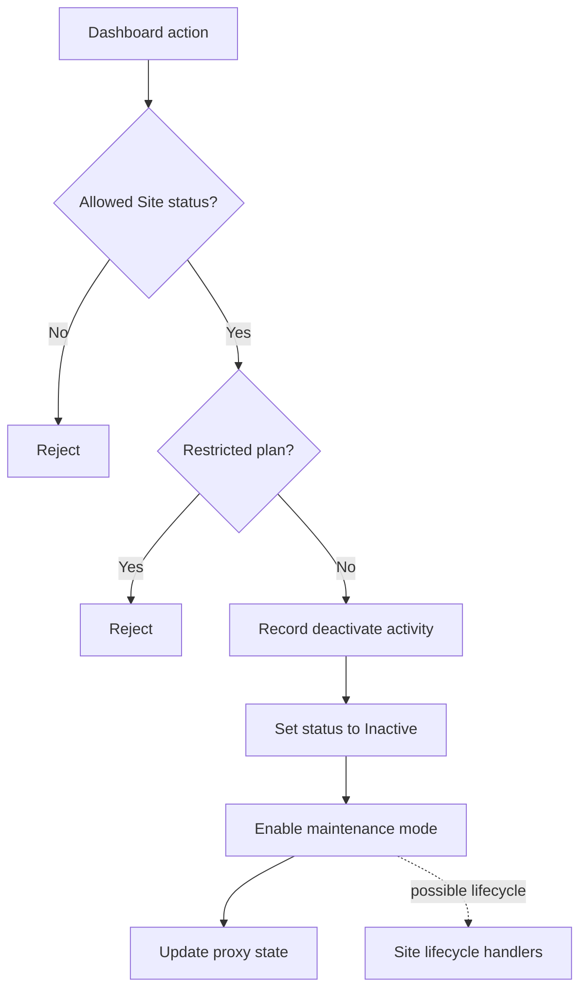

# 12 — Function Context and Mermaid Explanations

## Problem

Code is often difficult to understand even when the relevant function has already been found.

In many Frappe and Press modules:

- functions have no docstring;
- docstrings describe only the immediate action;
- important behavior is hidden in decorators;
- document writes trigger implicit Frappe lifecycle events;
- hooks can invoke additional functions;
- background jobs continue the workflow later;
- fields are mutated before a later `save()`;
- external systems are called through wrappers;
- important behavior is spread across multiple files;
- tests may describe the intended behavior better than the implementation.

A normal symbol index can answer:

```text
Where is this function?
What does it call?
Who calls it?
```

That is useful, but still insufficient for answering:

```text
What is this function responsible for?
What conditions must be true before it runs?
What state does it change?
What happens indirectly because of Frappe?
What external systems does it affect?
What are the important failure paths?
Which parts of the flow should Claude inspect next?
```

Merely showing raw callers and callees often creates more noise than understanding.

Docstrings cannot be treated as the primary source of function meaning because they may be missing, stale, incomplete, or too generic.

Beagle therefore needs a structured way to derive function context from behavior and a visual way to present the most important workflow.

---

## Benefit

A function-context layer turns Beagle from a repository graph into a code-understanding tool.

It allows Claude and developers to understand a function without reading many unrelated files.

The main benefits are:

### Faster understanding

Beagle can summarize the important behavior of a function before returning source.

Instead of reading an entire controller, Claude can first see:

```text
Purpose
Preconditions
Fields read and written
Important calls
Implicit lifecycle
External effects
Failure paths
Related tests
```

### Lower token usage

A compact structured context card is much smaller than:

- full source files;
- broad grep results;
- complete caller and callee lists;
- large hook files;
- framework internals.

Claude can request source only for sections that require verification.

### Better behavior discovery

Function meaning can be inferred from several independent facts:

```text
method name
decorators
guards
field writes
activity messages
important callees
background jobs
hooks
lifecycle events
external boundaries
tests
```

This is more reliable than depending on a docstring.

### Better Frappe understanding

A function may appear simple while indirectly causing:

```text
Document.save
→ validation
→ controller lifecycle methods
→ doc_events
→ background jobs
→ another document save
```

The context card and diagram can expose that hidden behavior.

### Easier communication

A compact Mermaid diagram helps developers quickly explain:

- the happy path;
- important decisions;
- failure paths;
- state transitions;
- external operations;
- framework-dispatched calls.

### Inspectable output

Every statement and diagram node can map back to:

```text
entity
relationship
source range
confidence
evidence
```

This keeps the explanation trustworthy.

---

## Product concept

For every important function or method, Beagle should be able to build a structured:

```text
Function Context Card
```

The card is generated from indexed evidence.

It is not a permanently stored free-form LLM summary.

Suggested structure:

```text
Identity
Inferred responsibility
Invocation and entrypoints
Preconditions and guards
Inputs and dependencies
Fields and documents read
Fields and documents changed
Important explicit calls
Implicit Frappe lifecycle
Background jobs
External systems
Return behavior
Failure paths
Callers
Related tests
Uncertainty
Source evidence
```

The same evidence can also produce a compact Mermaid diagram.

---

## Design principles

### Evidence first

Store structured facts, not generated prose, as the authoritative representation.

The explanation layer should render those facts.

### Docstrings are optional evidence

A docstring may improve the context card, but its absence must not reduce Beagle to raw call lists.

When present, compare the docstring with actual behavior.

Do not allow a stale docstring to override stronger source evidence.

### Separate direct and indirect behavior

Clearly distinguish:

```text
direct Python call
Frappe lifecycle dispatch
hook dispatch
background job
external operation
inferred relationship
```

### Prefer important behavior

Do not include every trivial call.

Prioritize:

```text
guards
state changes
persistence
exceptions
external systems
jobs
hooks
lifecycle
business actions
tests
```

### Preserve uncertainty

When purpose or behavior is unclear, say so.

Do not invent a business explanation.

### Progressive disclosure

The context card should support multiple detail levels:

```text
summary
direct behavior
expanded workflow
source evidence
```

The default should be compact.

---

## Function Context Card

## Identity

Include:

```text
qualified name
kind
class or module
path
source range
signature
decorators
```

## Inferred responsibility

Infer responsibility using weighted evidence:

```text
function or method name
owning class or DocType
activity or audit messages
fields written
important callees
entrypoint decorators
related tests
external operations
```

Represent the inference structurally.

Example:

```json
{
  "action": "deactivate",
  "subject": "Site",
  "evidence": [
    "method name: deactivate",
    "writes Site.status = Inactive",
    "records activity: Deactivate Site",
    "updates maintenance mode",
    "updates proxy status"
  ],
  "confidence": 0.98
}
```

The human-readable renderer may produce:

```text
Deactivates a Site by marking it inactive, enabling maintenance mode,
and updating proxy state.
```

## Invocation and entrypoints

Identify how the function can be reached:

```text
direct Python callers
whitelisted endpoint
dashboard action
scheduler hook
doc_events hook
controller lifecycle method
background job
command or migration entrypoint
```

## Preconditions and guards

Extract:

```text
decorators
permission checks
status restrictions
field requirements
early returns
assertions
frappe.throw calls
feature flags
configuration checks
```

Interpret known decorators semantically where possible.

Example:

```text
Allowed Site states:
  Active
  Broken

Access:
  Dashboard action
```

## Inputs and dependencies

Include:

```text
arguments
instance state used
configuration read
DocTypes loaded
fields read
constants
environment values
external clients
```

Avoid listing every local variable.

## State changes

Classify effects:

```text
local object mutation
persisted DocType write
field write
document insert
document save
document submit
document cancel
document delete
direct database write
configuration change
```

For every write, record:

```text
target
new value when statically known
condition
source range
persistence certainty
```

## Important calls

Rank calls by importance.

High-value calls include:

```text
business operation
persistence operation
background job
external request
shell command
security or permission check
state transition
notification
audit action
```

Low-value calls include:

```text
formatting
simple conversions
collection helpers
logging implementation details
trivial wrappers
```

Only high-value calls should appear in the default card.

## Implicit Frappe lifecycle

When the function performs a resolved document operation, include:

```text
operation
resolved DocType
lifecycle events
controller handlers
doc_events handlers
important downstream calls
```

Keep this separate from explicit calls.

Example:

```text
Implicit Frappe lifecycle

Site.save
  → Site.validate
  → Site.before_save
  → Site.on_update
  → Site.on_change
```

If installed-app order or runtime hooks are unknown, report that limitation.

## Background work

Include:

```text
enqueued function
queue
job name
enqueue-after-commit behavior
document method jobs
scheduler relationships
```

This is important because the visible function may only start a longer workflow.

## External boundaries

Identify:

```text
HTTP APIs
Agent calls
DNS providers
Certbot
shell commands
filesystem operations
system services
email
webhooks
```

Include arguments and failure handling when statically known.

Do not expose secret values.

## Return behavior

Extract:

```text
explicit return values
implicit None
early returns
generator behavior
exceptions raised
frappe.throw
retries
```

## Failure paths

Summarize:

```text
guard rejection
validation failure
external operation failure
database failure
exception handling
retry behavior
partial state changes
```

Do not claim runtime failures that cannot be derived from source.

## Callers

Include only important callers by default:

```text
entrypoints
workflow parents
hooks
jobs
tests
```

Do not dump every textual reference.

## Related tests

Use tests as evidence of intended behavior.

Include:

```text
directly calling tests
tests using the same DocType
tests asserting changed fields
tests covering failures
tests covering lifecycle handlers
```

Tests may improve the inferred responsibility and failure-path summary.

## Uncertainty

Record:

```text
unresolved receiver type
unknown installed-app order
site-only hooks unavailable
runtime configuration unavailable
dynamic call target
possible but unconfirmed lifecycle path
missing tests
```

The renderer should not hide uncertainty.

---

## Internal model

A possible internal structure:

```python
@dataclass
class FunctionContext:
    entity_id: str
    identity: FunctionIdentity
    responsibilities: list[Responsibility]
    entrypoints: list[Entrypoint]
    guards: list[Guard]
    reads: list[Effect]
    writes: list[Effect]
    calls: list[ImportantCall]
    lifecycle: list[LifecyclePath]
    jobs: list[BackgroundJob]
    external_boundaries: list[ExternalBoundary]
    returns: list[ReturnPath]
    failures: list[FailurePath]
    callers: list[RelatedEntity]
    tests: list[RelatedTest]
    unknowns: list[Unknown]
    evidence: list[Evidence]
```

This is a conceptual model.

Keep the actual implementation simple and split into focused classes.

---

## Context generation pipeline

```text
Selected function
   |
   +-- identity and source extraction
   +-- decorator interpretation
   +-- guard and branch extraction
   +-- reads and writes
   +-- important call ranking
   +-- Frappe operation expansion
   +-- hook and job expansion
   +-- external-boundary detection
   +-- caller selection
   +-- related test selection
   +-- uncertainty collection
   |
   +-- Function Context Card
   |
   +-- compact renderer
   +-- Claude context renderer
   +-- Mermaid renderer
```

Each stage should produce structured evidence.

---

## Importance ranking

Assign an importance score to observations and relationships.

Suggested high-value signals:

```text
writes a DocType field
persists a document
changes docstatus
raises or throws
returns early because of a guard
calls an external system
enqueues work
triggers lifecycle
handles an exception
records a business activity
appears in a relevant test
```

Suggested penalties:

```text
standard-library helper
formatting call
generic utility
duplicate path
low-confidence reference
distant graph node
```

Keep score explanations for debugging.

---

## Mermaid explanation

## Purpose

The diagram should present the function's important behavior at a glance.

It is not intended to be a complete compiler control-flow graph.

## Diagram content

Prefer:

```text
entrypoint
important guards
business decisions
state changes
important calls
document persistence
lifecycle events
background jobs
external boundaries
important failures
returns
```

Avoid:

```text
every assignment
every helper
all validation internals
all framework internals
all callers
all exception plumbing
```

## Edge types

Use visually distinct edges:

```text
solid edge    explicit call or control flow
dashed edge   Frappe lifecycle or hook dispatch
dotted edge   uncertain relationship
thick edge    optional representation of primary workflow
```

The exact style may be adjusted to valid Mermaid syntax.

## Node types

Suggested semantic node classes:

```text
entry
guard
operation
state_change
persistence
framework_event
background_job
external_boundary
failure
return
```

## Node limits

Default limits:

```text
maximum nodes: 20
maximum expanded call depth: 2
maximum lifecycle depth: 2
```

When the graph is larger:

- keep the primary path;
- collapse low-value groups;
- mention omitted branches;
- allow deeper evidence inspection separately.

## Evidence mapping

Every Mermaid node and edge must map to:

```text
entity or observation ID
path
source range
relationship type
confidence
```

The rendered Markdown should include a source legend or structured metadata after the diagram.

## Label generation

Labels should be concise and deterministic.

Examples:

```text
Check allowed Site status
Reject trial plan
Set Site.status = Inactive
Enable maintenance mode
Update proxy state
Save Site
Run on_update handlers
```

A future LLM may shorten labels, but it must not alter graph topology.

## Branches

Preserve meaningful conditions:

```text
Trial plan?
Allowed status?
External call succeeded?
Retry allowed?
```

Do not display complex raw expressions when a short source-backed label is available.

## Failure paths

Include failures when they are important to understanding the function:

```text
frappe.throw
raised exception
external failure
validation failure
early stop
```

Do not clutter the diagram with generic exceptions from every callee.

## Framework expansion

When a document operation is expanded:

```text
function
→ document save
-. framework .→ lifecycle event
-. handler .→ controller or hook
```

The diagram should make clear that the original function did not explicitly call the lifecycle handler.

---

## Rendering levels

## Summary

Small card, no source excerpts.

Useful for search results and initial Claude exploration.

## Detailed card

Includes important direct and implicit behavior, callers, tests, and evidence references.

## Workflow diagram

Includes the most important control flow and side effects.

## Expanded explanation

Includes selected source ranges for Claude.

Progressive disclosure prevents unnecessary context.

---

## Example: Site.deactivate

A context card may contain:

```text
Identity
  Site.deactivate

Responsibility
  Deactivates a Site and removes it from active serving.

Invocation
  Dashboard action.

Guards
  Site status must be Active or Broken.
  Trial plans are rejected.
  Frappe plans are rejected.

State changes
  Site.status → Inactive.
  maintenance_mode → enabled.

Important operations
  Records a deactivate activity.
  Updates site configuration.
  Updates proxy status.

Implicit lifecycle
  A downstream save may trigger Site lifecycle handlers.

External systems
  Application server Agent.
  Proxy server Agent.

Failures
  Invalid status.
  Restricted plan.
  Agent operation failure.

Tests
  Relevant deactivate and status-transition tests.

Unknowns
  Site-configured hooks unavailable without a snapshot.
```

A diagram may show:



The actual graph must reflect indexed source evidence.

---

## Implementation plan

## Phase A — structured context model

- [ ] Define the minimum context-card model.
- [ ] Reuse existing entities, observations, and edges.
- [ ] Add evidence references to every item.
- [ ] Avoid storing generated prose as authority.
- [ ] Add compact serialization.

## Phase B — direct behavior extraction

- [ ] Interpret decorators.
- [ ] Extract guards and early returns.
- [ ] Extract field and document reads.
- [ ] Extract state and persistence writes.
- [ ] Extract exceptions and return behavior.
- [ ] Rank important calls.
- [ ] Detect external boundaries.

## Phase C — indirect behavior

- [ ] Expand document lifecycle.
- [ ] Expand exact and wildcard hooks.
- [ ] Expand background jobs.
- [ ] Expand important downstream calls.
- [ ] Resolve relevant controller overrides and extensions.
- [ ] Preserve unknown runtime handlers.

## Phase D — responsibility inference

- [ ] Derive action and subject from names.
- [ ] Use owning DocType and class.
- [ ] Use field writes and activity messages.
- [ ] Use important callees.
- [ ] Use entrypoints and tests.
- [ ] Produce confidence and evidence.
- [ ] Return unknown when evidence is weak.

## Phase E — test association

- [ ] Find direct test callers.
- [ ] Find tests using the same DocType.
- [ ] Find tests asserting relevant fields.
- [ ] Find tests covering failure paths.
- [ ] Use tests as supporting intent evidence.

## Phase F — compact rendering

- [ ] Render identity and inferred responsibility.
- [ ] Render guards, state changes, and important operations.
- [ ] Separate explicit and implicit behavior.
- [ ] Render failures, tests, and unknowns.
- [ ] Support token-budgeted output.

## Phase G — Mermaid graph building

- [ ] Build simplified control-flow nodes.
- [ ] Add important calls and side effects.
- [ ] Add framework-dispatch edges.
- [ ] Add jobs and external boundaries.
- [ ] Add important failures and returns.
- [ ] Apply node and depth limits.
- [ ] Collapse low-value subgraphs.
- [ ] Map every node and edge to evidence.

## Phase H — integration

- [ ] Make context cards available to search ranking.
- [ ] Use cards in issue investigation.
- [ ] Use cards in Claude context compilation.
- [ ] Include Mermaid only when useful.
- [ ] Keep function-context generation independent of command names.
- [ ] Add compact MCP serialization later.

---

## Benchmark plan

## Synthetic cases

Create fixtures for:

1. missing docstring;
2. stale docstring;
3. meaningful decorator;
4. status guard;
5. multiple early returns;
6. state-field write;
7. direct database write;
8. document save and lifecycle;
9. background job;
10. external command;
11. exception handling;
12. related tests;
13. ambiguous responsibility;
14. unknown runtime hook;
15. large function requiring diagram compression.

## Real repository cases

Select at least 30 functions from Frappe and Press:

```text
controller methods
background jobs
scheduler handlers
API endpoints
document lifecycle methods
Agent wrappers
failure handlers
state-transition methods
```

Include functions with and without docstrings.

Manually record:

```text
expected responsibility
important guards
important state changes
important calls
implicit lifecycle
external boundaries
failure paths
relevant tests
must-not-include noise
```

## Accuracy targets

```text
Important guard recall                     >= 95%
Important state-change recall              >= 95%
Persistence-operation recall               >= 95%
Important call precision                   >= 90%
Lifecycle-path precision                   >= 98%
External-boundary precision                >= 95%
Relevant-test recall                       >= 85%
Unsupported high-confidence statements     = 0
```

## Context quality targets

```text
Human-rated usefulness                     >= 4/5
Irrelevant context ratio                   <= 20%
Default context size                       <= 500 tokens
Detailed context size                      within requested budget
Claude source lines read reduction         >= 50%
```

## Mermaid targets

```text
Invented nodes or edges                    = 0
Primary workflow preserved                 >= 95%
Important decision recall                  >= 90%
Important state-change recall              >= 90%
Diagram node count                         <= configured limit
```

---

## Risks

### Over-inference

Function names may be misleading.

Mitigation:

- require multiple evidence signals;
- include confidence;
- return unknown when necessary.

### Too much context

Call graphs can become large.

Mitigation:

- importance ranking;
- progressive disclosure;
- category budgets;
- node limits.

### Hidden runtime behavior

Site-configured hooks may be unavailable.

Mitigation:

- show runtime dispatch channels;
- report unknown concrete handlers;
- support a site snapshot later.

### Misleading diagrams

Simplification can hide important behavior.

Mitigation:

- preserve primary branches and state changes;
- disclose omitted nodes;
- map every rendered item to evidence.

### Stale generated summaries

Stored prose can become outdated.

Mitigation:

- generate cards from current structured facts;
- invalidate on owned-file or relationship changes;
- do not treat prose as authoritative.

---

## Definition of done

This plan is complete when Beagle can take a function with no useful docstring and produce:

- a concise evidence-backed responsibility;
- invocation and entrypoint information;
- important preconditions;
- fields and documents read or changed;
- important explicit calls;
- implicit Frappe lifecycle behavior;
- background jobs and external effects;
- return and failure behavior;
- important callers and tests;
- explicit uncertainty;
- a compact Mermaid diagram with source-backed nodes and edges.

The output should let Claude understand the function before reading large amounts of source.

---

## Implementation status

Implemented in `beagle/card/` and surfaced via `beagle card` (CLI) and the
`function_context` MCP tool. Mapping to the plan above:

- Phase A (model) — done: `card/model.py`, evidence-line per item, `as_dict`.
- Phase B (direct behaviour) — done: `card/classify.py` + `ContextCardBuilder`
  cover decorators, guards/thresholds/throws, reads, state/field/operation
  writes, ranked important calls, external boundaries, raises/handles.
- Phase C (indirect behaviour) — mostly done: implicit lifecycle (operation →
  events → terminal handlers), jobs, callers; runtime override order preserved
  as an explicit unknown. Deeper hook fan-out beyond terminal handlers is not
  expanded.
- Phase D (responsibility) — done: action verb + subject + weighted evidence +
  confidence; returns "(responsibility uncertain)" below a confidence floor.
- Phase E (tests) — partial: direct TESTS edges and test-fn callers; field- and
  failure-specific test heuristics not yet added.
- Phase F (compact rendering) — done: importance-ordered, token-budgeted; the
  Unknowns section always survives the budget.
- Phase G (Mermaid) — done: `card/mermaid.py`, solid explicit / dashed
  lifecycle+boundary edges, 20-node cap, deterministic insertion-order ids.
- Phase H (integration) — partial: CLI + MCP done; not yet folded into the
  `context` compiler intents or seed ranking.

Synthetic benchmark cases (missing/stale docstring, decorator, status guard,
early returns, state-field write, save+lifecycle, background job, external
command, exception handling, related tests, ambiguous responsibility, unknown
runtime hook, diagram compression) are exercised by `tests/card/`. The 30+
manually-verified real-repo gold set and its accuracy gates need human
verification and are deferred rather than fabricated (correctness rules).
