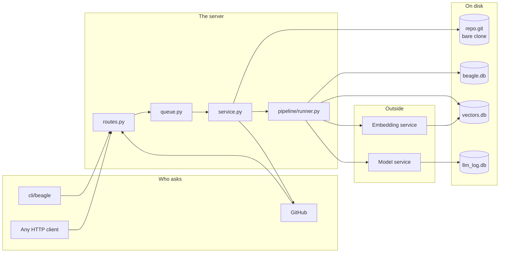
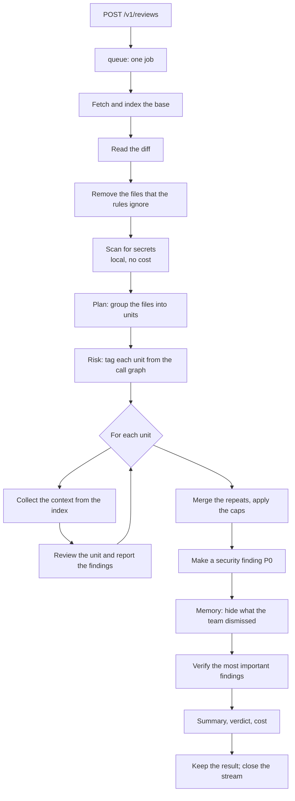
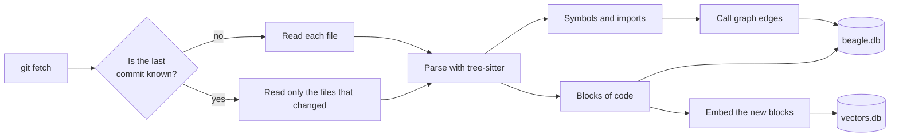
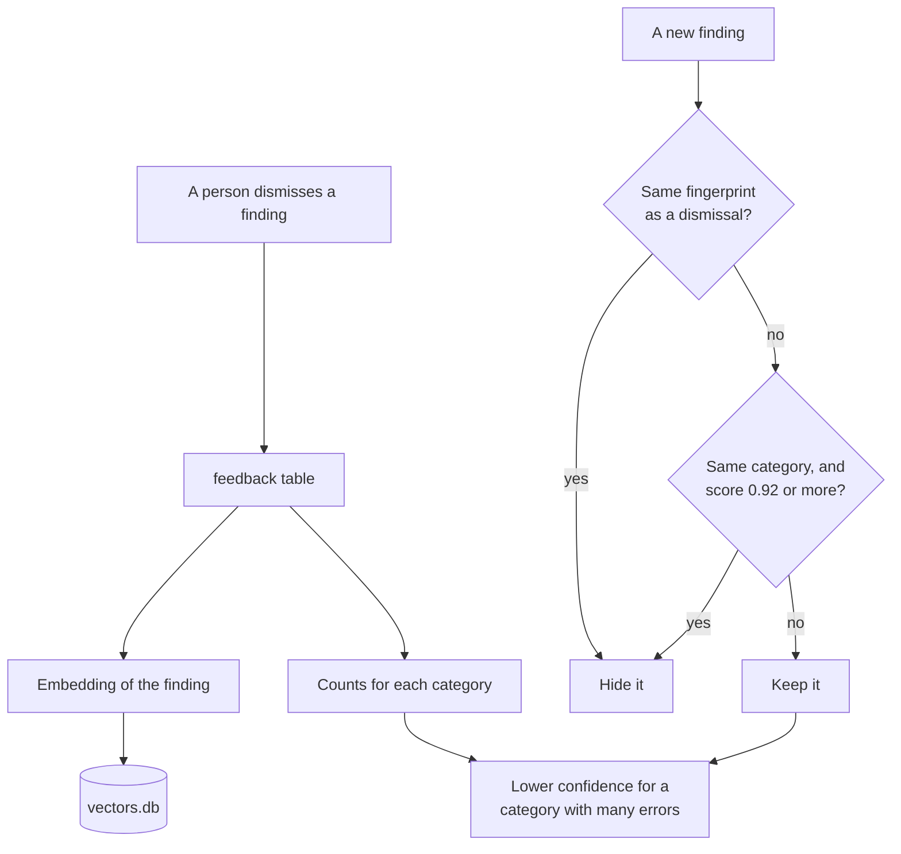
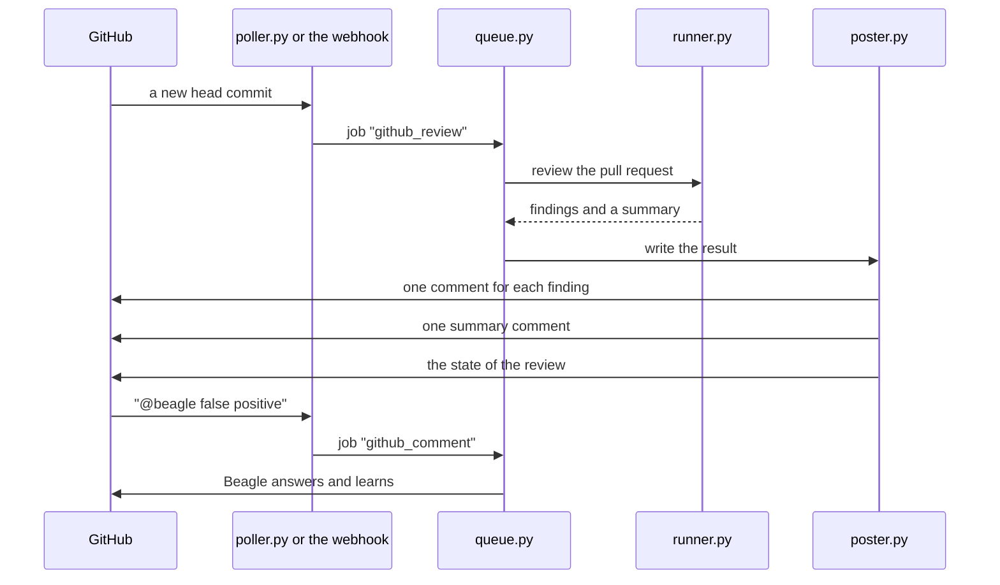
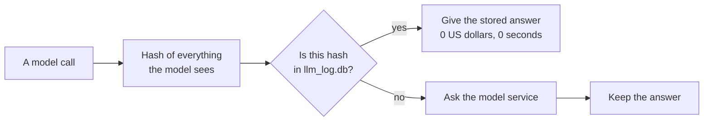

# How Beagle works

This document shows the parts of Beagle, the folder of each part, and the flow of the work between them. Read [README.md](README.md) first for the short description.

## The parts

Beagle is one process. It holds a copy of the repository, an index of the code, a job queue, and a review pipeline. Three SQLite files hold the data.



Three rules control this design:

- One server gives service to one repository.
- The HTTP layer starts no work. It only puts a job in the queue.
- Each part reads the databases through `storage/dao.py`, not through raw SQL.

## The folders

```
beagle/
├── config.py            each configuration key, and the source of its value
├── constants.py         the limits that no configuration key can change
├── errors.py            the error types
├── report.py            a result in Markdown, for a person
│
├── server/              the HTTP layer and the wiring
│   ├── app.py           makes the FastAPI application, starts and stops the parts
│   ├── routes.py        each path, and the webhook
│   ├── auth.py          the bearer token
│   ├── service.py       holds every part; sends each job to its handler
│   ├── queue.py         the durable job queue and the worker threads
│   ├── reporting.py     the answers for stats, doctor, and the index status
│   └── guide.py         the text that /v1/guide gives to a coding agent
│
├── repo/                git
│   ├── mirror.py        the bare clone; fetch, diff, read a file
│   ├── selection.py     which files Beagle may look at
│   └── diff.py          reads a unified diff into objects
│
├── index/               the structural index
│   ├── indexer.py       keeps the index in step with one commit
│   ├── languages.py     the tree-sitter grammars and the queries
│   ├── symbols.py       the definitions, the imports, and the call sites
│   ├── graph.py         makes the call graph from the call sites
│   ├── chunking.py      cuts each file into blocks, one block for each symbol
│   ├── embeddings.py    the client for the embedding service
│   ├── embedder.py      embeds the blocks that have no vector
│   └── vectors.py       the sqlite-vec tables
│
├── pipeline/            one review, from a diff to a summary
│   ├── runner.py        the sequence of the passes, and the limits
│   ├── models.py        Finding, ReviewUnit, ReviewState, ReviewSummary
│   ├── planner.py       groups the changed files into units
│   ├── risk.py          gives a risk tag to a unit from the index
│   ├── context.py       fills the token budget of each unit
│   ├── instructions.py  finds the rules files of the repository
│   ├── review.py        one unit, one model call, findings
│   ├── dedup.py         collapses the repeats; applies the caps
│   ├── security.py      makes a security finding in application code P0
│   ├── verify.py        checks the most important findings a second time
│   ├── summary.py       writes the summary and the confidence
│   ├── schemas.py       the JSON schema of each model answer
│   └── events.py        the NDJSON event stream
│
├── memory/              what the team taught Beagle
│   ├── filter.py        applies all three parts below to new findings
│   ├── suppression.py   hides a finding that the team dismissed before
│   ├── rules.py         the conventions of the team, in one short block
│   └── calibration.py   corrects the confidence for each category
│
├── llm/
│   └── client.py        the model calls, the cost budget, and answer reuse
│
├── scan/
│   └── secrets.py       a local scan for keys; no model, no cost
│
├── prompts/
│   ├── loader.py        loads the prompts and the operator overrides
│   └── defaults/        the built-in prompts, one Markdown file for each
│
├── github/              optional
│   ├── driver.py        holds the parts below; the only attribute the service keeps
│   ├── client.py        the REST calls
│   ├── poller.py        asks GitHub for new work every 60 seconds
│   ├── events.py        reads a webhook delivery; checks the signature
│   ├── poster.py        writes the comments, the summary, and the state
│   ├── comments.py      reads a "@beagle ..." comment and does the command
│   └── state.py         what Beagle already did to each pull request
│
├── storage/
│   ├── db.py            the three databases and the transactions
│   ├── dao.py           every query; IndexStore and CallLog
│   ├── migrations.py    applies the .sql patches and records them
│   └── schema/          core/, vectors/, llm_log/
│
├── eval/
│   └── harness.py       runs the golden cases in evals/golden.json
│
└── cli/                 the commands of the server
    ├── parser.py        the options
    ├── commands.py      serve, index, doctor, review, eval, guide
    └── output.py        the text for a terminal

cli/beagle               the client; one file, Python 3.7, no dependencies
docs/                    these documents
evals/golden.json        the golden cases
data/                    the configuration and the three databases
```

## Flow: one review



`pipeline/runner.py` holds this sequence. Each step writes into one `ReviewState` object. The last step reads all of it.

The code applies the important limits, not the prompts:

| Limit | Where |
| --- | --- |
| A security finding is never dropped or capped | `pipeline/security.py`, `pipeline/dedup.py` |
| 2 P5 findings and 3 P4 findings at the most | `pipeline/dedup.py` |
| 12 findings at the most | `pipeline/dedup.py` |
| The cost limit and the time limit | `llm/client.py` |
| The severity floor | `pipeline/runner.py` |

A person who changes a prompt cannot remove them.

## Flow: the index

The index always shows one commit of the base branch. Beagle does not make an index for each pull request. A review reads the index and puts the diff on top of it.



Beagle keeps the hash of the content of each file. A file with the same hash is not parsed again. So a fetch that changes 3 files costs the work of 3 files.

If a force push removes the commit that Beagle indexed, Beagle reads each file again. `indexer.py` finds this condition with `mirror.has_commit`.

## Flow: the memory



The fingerprint is `file | category | title`. It holds no line numbers, because line numbers move. Refer to [memory.md](memory.md) for the scores and the conditions.

## Flow: a pull request



Beagle finds its own comments by a hidden marker in the text. The marker holds the fingerprint. Refer to [github.md](github.md).

## Internals

### The mirror

`repo/mirror.py` keeps a bare clone in `data/repo.git`. Every part reads from it. No part makes a checkout, so two reviews cannot disturb each other.

The token goes to git as a header, not in the URL. So the token is not in the configuration of the clone.

A pull request head comes from `+refs/pull/<n>/head`. The `+` makes the fetch forced, so a force push also operates.

### The file selection

`repo/selection.py` decides what Beagle may look at. It uses four rules in sequence:

1. `.gitignore`, because git keeps the ignored files out of the clone.
2. `.beagleignore` in the root of the repository.
3. The `[repo].ignore` patterns in the configuration.
4. The limits: no binary file, no empty file, no file of more than 512 KB.

The summary of each review shows the files that Beagle did not read.

### The indexer

`index/indexer.py` gives the index one commit. For each file it does this work:

| Step | File | Result |
| --- | --- | --- |
| Parse | `symbols.py` | The definitions, the imports, and the call sites |
| Resolve | `graph.py` | An edge from a call site to the definition |
| Cut | `chunking.py` | One block for each symbol, 6000 characters at the most |
| Embed | `embedder.py` | One vector for each block |

`graph.py` resolves a call in three steps: the same file, then an imported file, then a name that is unique in the repository. A name that is not unique stays a text edge. Beagle tries these edges again after each index run.

The embedding step is separate from the parse step. A block gets a vector later. If the embedding service does not answer, the index is still correct. The review loses only the "similar code" part of the context. `doctor` reports this condition.

### The context of a unit

`pipeline/context.py` fills the token budget of one unit in this sequence:

1. The diff of the unit.
2. The other files that still name what the diff removes or renames.
3. The related symbols from the call graph, first the signatures, then the bodies.
4. Similar code from the vector search.

Beagle stops when the budget is full. It writes the names of the parts that did not fit into the prompt and into the summary. Nothing disappears in silence.

All four steps are code: tree-sitter, sqlite-vec and `git grep`. They are fast, free and exact. Beagle gave the same job to a model with tools two times, and measured it two times. A reviewer with tools found 2 of 9 known defects where the same reviewer with this context found 4. A separate model with tools, which collected context and gave it to the reviewer, found 25 of 56 where this context found 31. It also cost 1.8 times more and took 3 times longer. So the retrieval stays in code.

### The model calls

`llm/client.py` makes each call. One `Budget` object holds the cost limit and the time limit of the whole review. Each answer must agree with a JSON schema from `pipeline/schemas.py`.

The reasoning model reviews every unit. The general model does the plan, the merge, the summary, and a reply to a comment. Only a security or P0 finding gets the reasoning model again for the second check.

Beagle keeps each call in `llm_log.db`: the request, the answer, the tokens, and the cost. This log has two uses. It shows the cost for each review, and it makes answer reuse possible.

### Answer reuse



The hash holds the prompt, the model, and the diff of the unit. It also holds the related code and the conventions of the team. A change to any of them makes a different hash.

So a person who asks for a review again pays only for the units that changed. Refer to "Reviews of almost the same change" in [reviews.md](reviews.md).

### The queue

`server/queue.py` holds a durable queue in `beagle.db`. The HTTP layer puts a job in the queue and answers 202. The worker threads take the jobs.

| Job | Tries |
| --- | --- |
| `review` | 1 |
| `github_review` | 1 |
| `index` | 3 |
| `github_comment` | 3 |

A review gets one try, because a review costs money. After a restart, Beagle marks an interrupted review as failed and does not repeat it.

### The event stream

`pipeline/events.py` keeps one stream for each review. The stream holds each event, and it also sends each event to the readers now.

So a reader gets the same sequence in all three conditions: before the review starts, during the review, and after the review. The server keeps the last 64 streams.

### The three databases

| File | Content | If you lose it |
| --- | --- | --- |
| `beagle.db` | The index, the reviews, the findings, the feedback, the rules, the jobs | Beagle loses the memory of the team |
| `vectors.db` | The embeddings of the blocks and of the findings | Beagle makes them again |
| `llm_log.db` | Each model call, with the request and the answer | Beagle loses the cost history and the reuse |

`storage/db.py` gives each file one connection and one lock. One process owns all of them. So a read and a write in one transaction is safe between the threads.

`storage/migrations.py` applies the `.sql` patches in sequence and keeps a checksum of each one. If a patch on disk is different from the patch that ran, the server stops at the start. It does not guess.

### The prompts

`prompts/loader.py` loads the built-in prompts from `prompts/defaults/`. An operator can replace a prompt with `<name>.md`, or add text after it with `<name>.append.md`.

The text of the prompt goes into the hash of the call. So a change to a prompt makes each stored answer invalid. The next review asks the model again. Refer to [prompts.md](prompts.md).

### The eval harness

A change to a prompt or to a limit can make Beagle better or worse. `eval/harness.py` measures the change.

`evals/golden.json` holds the examples. Each example has a diff, the findings that Beagle must give, and the findings that Beagle must not give. `beagle eval` runs each example through the same pipeline as a review, and it counts four values: the recall, the false positives, the extra findings, and the cost.

The third example has no expected finding. It is a clean rename. It measures restraint, because a reviewer that reports something here is a bad reviewer.

The exit code is 0 if all the examples passed. So a pipeline of continuous integration can use this command. Refer to [cli.md](cli.md).

## Where to look

| Question | File |
| --- | --- |
| Why did Beagle not read this file? | `repo/selection.py` |
| Why is this finding P0? | `pipeline/security.py` |
| Why did this finding disappear? | `memory/suppression.py` |
| Why did this review cost so much? | `llm/client.py`, `llm_log.db` |
| Why is this unit with that unit? | `pipeline/planner.py` |
| Why did Beagle not write a comment? | `github/poster.py` |
| Why did the index start again? | `index/indexer.py` |
